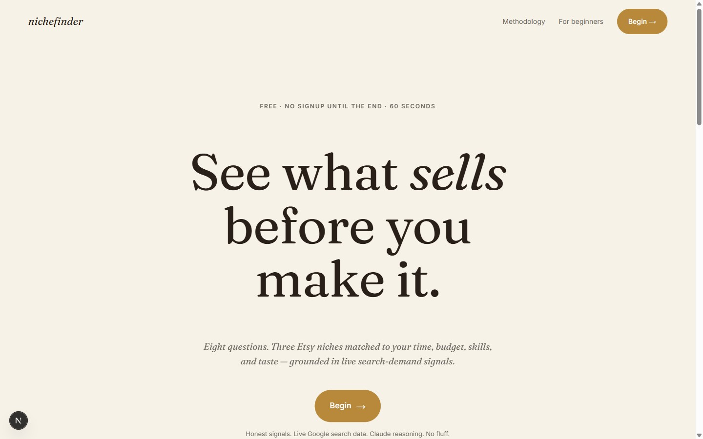
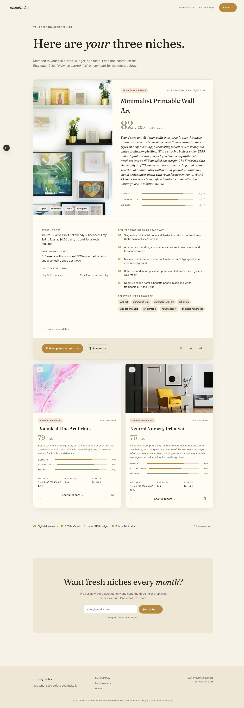
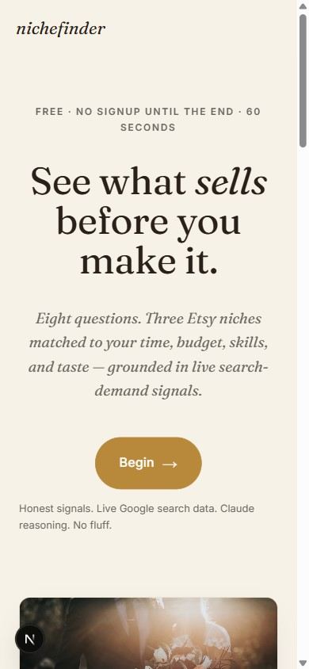
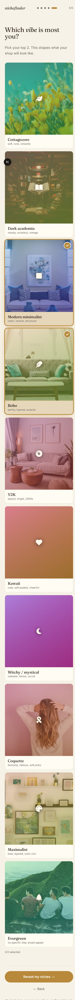
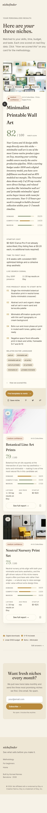
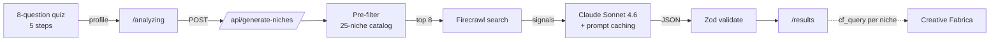

<div align="center">

# *nichefinder*

**See what *sells* before you make it.**

A free, no-signup AI tool that takes an aspiring Etsy seller from
*"I have no idea what to sell"* to **three matched niches with real numbers behind them** —
in under a minute.

[](https://nextjs.org/)
[](https://www.typescriptlang.org/)
[](https://www.anthropic.com/)
[](https://firecrawl.dev/)
[](LICENSE)

<br/>



</div>

<br/>

## What it is

Eight quiz questions across five steps capture a seller's **time, budget, skills, equipment, aesthetic, and timeline**. The pipeline pre-filters a hand-curated 25-niche catalog, pulls live search-demand signals from Google via Firecrawl, then has Claude Sonnet 4.6 score the candidates against an 8-component framework and write a 90–120 word "why this fits *you*" for each top-three pick. Every score is shown alongside the data source — *grounded*, *modeled*, or *reasoned* — so the methodology is auditable from the result card.

Built as a satellite-app prototype for the Creative Fabrica *Vibe Coder — Satellite Apps Marketer* role. The full v2 product spec lives in [`docs/BUILD_SPEC.md`](docs/BUILD_SPEC.md). System architecture in [`docs/architecture.md`](docs/architecture.md).

<br/>

## The product

<table>
  <tr>
    <td width="50%" valign="top"></td>
    <td width="50%" valign="top">
      <h3>Results card</h3>
      <p>One hero card with the full breakdown — score, why-this-fits-you (italic Fraunces), three live sub-scores, startup cost, time-to-first-sale, five product ideas, related buyer language, and a "How we scored this" expand showing all 8 components and their data source. Two compact cards beneath show ranks 02 + 03 with a click-to-expand into the same hero layout.</p>
      <p>Per-niche hero photos. Per-niche Creative Fabrica search query that maps to the assets a seller of that niche actually needs — templates to remix for digital, clipart for POD, mockups + fonts + label templates for handmade.</p>
    </td>
  </tr>
</table>

### Mobile

<table>
  <tr>
    <td width="33%" valign="top"></td>
    <td width="33%" valign="top"></td>
    <td width="33%" valign="top"></td>
  </tr>
  <tr>
    <td align="center"><sub>Landing</sub></td>
    <td align="center"><sub>Aesthetic selector (2 of 10 chosen)</sub></td>
    <td align="center"><sub>Results — hero + compact</sub></td>
  </tr>
</table>

<br/>

## How it works



The pipeline degrades gracefully — missing keys return curated mock data with a warning banner; Firecrawl failures pass through with `signal_unavailable: true` and Claude marks those niches as reduced confidence.

Full architecture, layer-by-layer responsibilities, and resilience details: **[`docs/architecture.md`](docs/architecture.md)**.

<br/>

## Stack

| Concern | Choice | Why |
| --- | --- | --- |
| Framework | **Next.js 16** (App Router, React 19, Turbopack) | Server-rendered SEO pages + client islands for the quiz. |
| Language | **TypeScript 5** | Real types across every API boundary. |
| Validation | **Zod 4** | Schemas at every untrusted edge — the seller profile, Claude's JSON output, sessionStorage reads. |
| AI | **`@anthropic-ai/sdk`** with `claude-sonnet-4-6` | System-prompt caching cuts input tokens ~40% per quiz. |
| Live data | **`@mendable/firecrawl-js` v4** with `search()` | Google-backed niche-demand signals; Etsy direct-scrapes are blocked, so the pivot is documented in `docs/architecture.md`. |
| Cache | **In-memory TTL map** (24h) | Drop-in swap to Vercel KV in production. |
| Styling | **Custom CSS** with design tokens via CSS variables | Spec § 9 maps cleanly; no utility-class bloat for a single-app MVP. |
| Fonts | **Fraunces** (display) + **Inter** (body) via `next/font/google` | Editorial register; Fraunces optical sizing reads beautifully large. |

No database. No auth. No tracking pixels.

<br/>

## Run locally

Requires Node 20+ and npm.

```bash
git clone https://github.com/<your-username>/nichefinder.git
cd nichefinder
npm install

# Optional — set up live API keys (without these the app returns mock data)
cp .env.example .env.local
# fill in ANTHROPIC_API_KEY and FIRECRAWL_API_KEY

npm run dev          # http://localhost:3000
npm run build        # production bundle
npm run start        # serve the production build
npm run typecheck    # tsc --noEmit
```

<br/>

## Project structure

```
.
├── docs/
│   ├── BUILD_SPEC.md          # Full v2 product spec (the document this MVP was built from)
│   ├── architecture.md        # System overview, layers, data flow, resilience, roadmap
│   └── screenshots/           # Polished captures used in this README
├── src/
│   ├── app/                   # Next.js App Router routes
│   │   ├── layout.tsx         # Root layout, fonts (next/font), metadata
│   │   ├── page.tsx           # Landing
│   │   ├── icon.svg           # Brass-on-cream "n" favicon (file convention)
│   │   ├── quiz/[step]/       # 5-step quiz flow
│   │   ├── analyzing/         # 50s smooth labor-illusion loader; calls the API
│   │   ├── results/           # 1 hero card + 2 compact cards
│   │   ├── methodology/       # 8-component scoring transparency page
│   │   ├── beginners/         # SEO landing variant
│   │   └── api/
│   │       └── generate-niches/  # Orchestrator route handler
│   ├── components/            # Nav, Footer, NicheCards, primitives
│   ├── data/
│   │   ├── catalog.ts         # 25-niche starter set (spec calls for ~150)
│   │   └── quiz.ts            # Typed 8-question schema, vibe metadata
│   └── lib/
│       ├── claude.ts          # Anthropic call + JSON parse + 1 retry
│       ├── firecrawl.ts       # search()-based signal pipeline
│       ├── candidates.ts      # Pre-rank against seller profile
│       ├── cache.ts           # In-memory TTL cache (Vercel KV swap point)
│       ├── quiz-state.ts      # sessionStorage hook with Zod guards
│       ├── schemas.ts         # Zod schemas for every payload boundary
│       ├── types.ts           # Shared TypeScript types
│       └── mock.ts            # Fallback recommendations when keys are absent
├── public/                    # Served at the site root
├── .env.example
├── .gitignore
├── LICENSE                    # MIT
├── next.config.ts
├── package.json
├── README.md                  # ← you are here
└── tsconfig.json
```

<br/>

## Honest data posture

The original spec called for direct scrapes of `etsy.com/search?q=...`. In practice **Etsy aggressively bot-blocks scrapers**, even with Firecrawl's stealth proxy, and Pinterest is unsupported by Firecrawl. So the live data layer pivoted to Firecrawl's `search()` endpoint (Google-backed): the app measures how many of the top 20 web results for a niche query land on Etsy, and synthesizes related-search language from result titles via n-gram analysis. This is honest demand-density grounding without claiming data Etsy doesn't expose.

The methodology page tells users exactly which signals are *grounded*, *modeled*, or *reasoned* — see [`/methodology`](src/app/methodology/page.tsx).

To upgrade to direct Etsy listing data: route Firecrawl through a residential-proxy service (Bright Data, Oxylabs). Same code, just better proxies behind it.

<br/>

## Roadmap

| When | Item | Why |
| --- | --- | --- |
| Soon | Catalog 25 → 150 niches | Spec § 7. The catalog is the durable IP — incumbents have data; this tool has curation. |
| Soon | Vercel KV swap for the in-memory cache | Production cold starts will start missing the cache. |
| Soon | Wire email capture to Resend | Currently a stub. Spec § 11 phase 8. |
| Soon | `/trending` · `/low-competition` · `/digital-products` SEO landing variants | Each pre-fills quiz state via URL. Spec § 12. |
| Maybe | Residential-proxy upgrade for direct Etsy data | Restores avg price / review counts / shop age that the v1 spec called for. |
| Maybe | Per-result Open Graph image generator | Pinterest-pinnable cards are the highest-leverage distribution channel for this audience. |

<br/>

## Credits

Built in Barcelona by [**Korneel Kennes**](mailto:korneel@chamelio.co).

Not affiliated with or endorsed by Etsy or Creative Fabrica. *Etsy* is a trademark of Etsy, Inc. Niche photos hot-linked from [Unsplash](https://unsplash.com/) under their permissive license.

<sub>MIT licensed — see [LICENSE](LICENSE).</sub>
